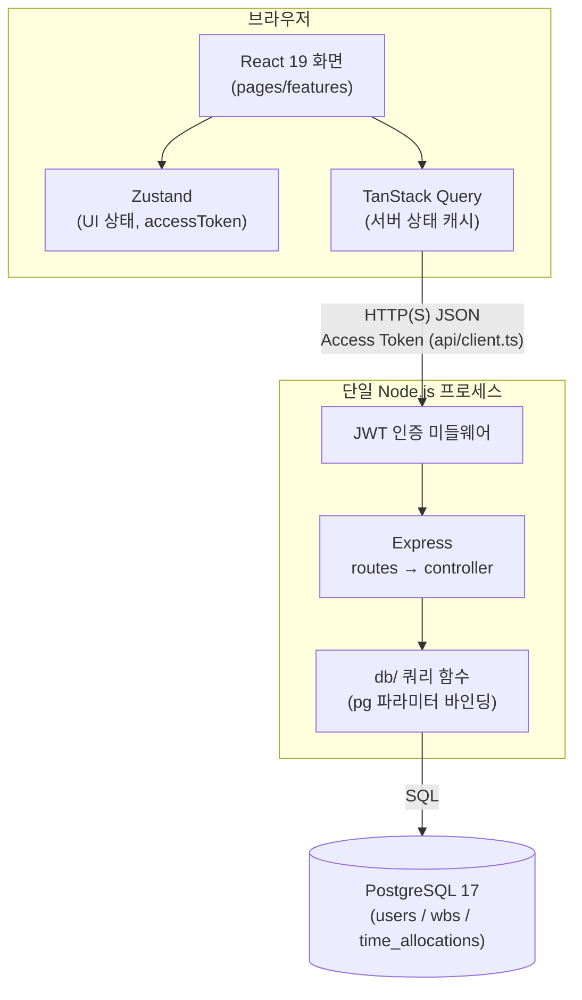
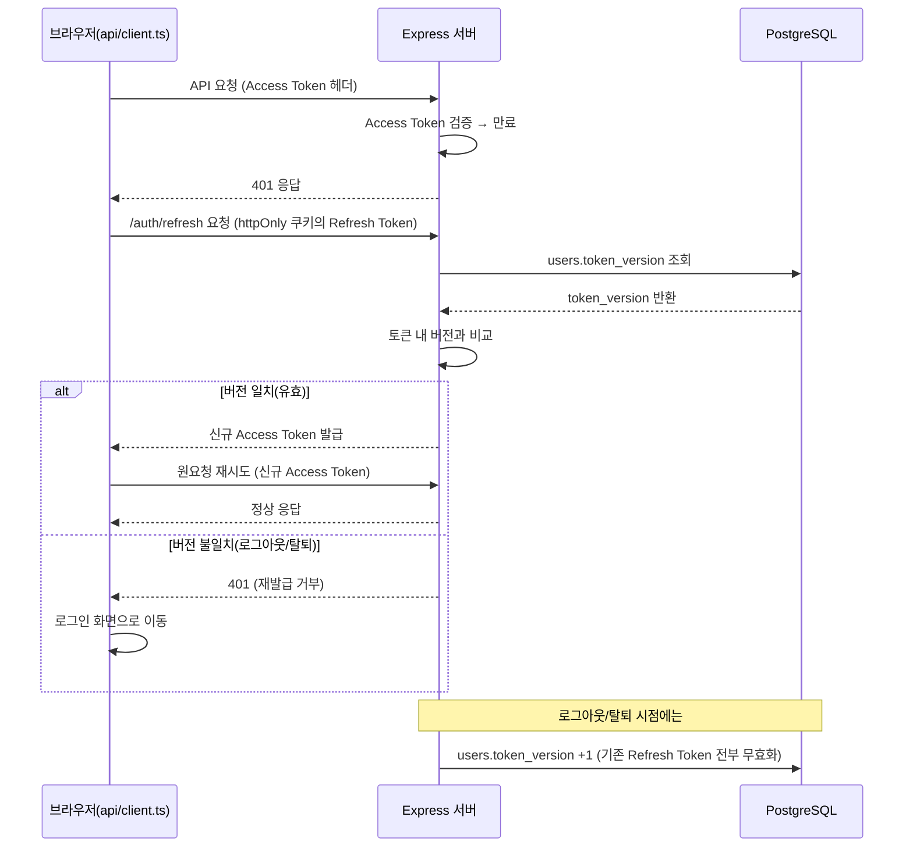
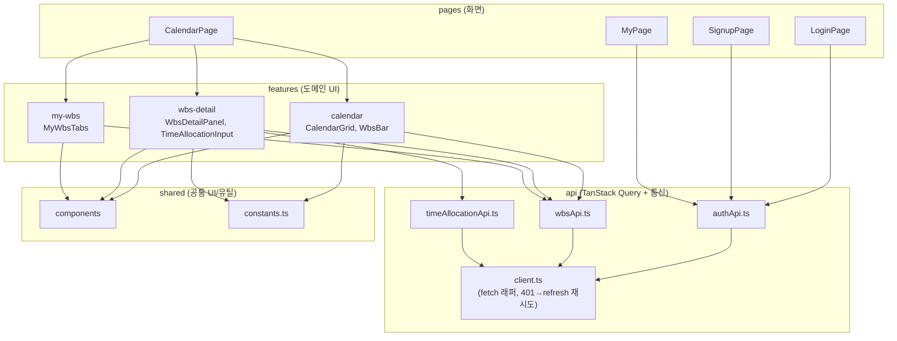

# 5. 기술 아키텍처 다이어그램

## 5.1 전체 시스템 구성도

브라우저(React) - 단일 Node.js 서버 - PostgreSQL 단일 인스턴스로 구성된 계층 구조.

## 5.2 인증(JWT access/refresh 재발급) 흐름

Access Token 만료 시 401 응답을 받으면 Refresh Token(httpOnly 쿠키)으로 재발급받는 흐름.

## 5.3 프론트엔드 컴포넌트 구조

계층 의존 방향은 `pages → features → api → shared` 한 방향, 역방향 import 금지(4-project-principle.md 2절).

