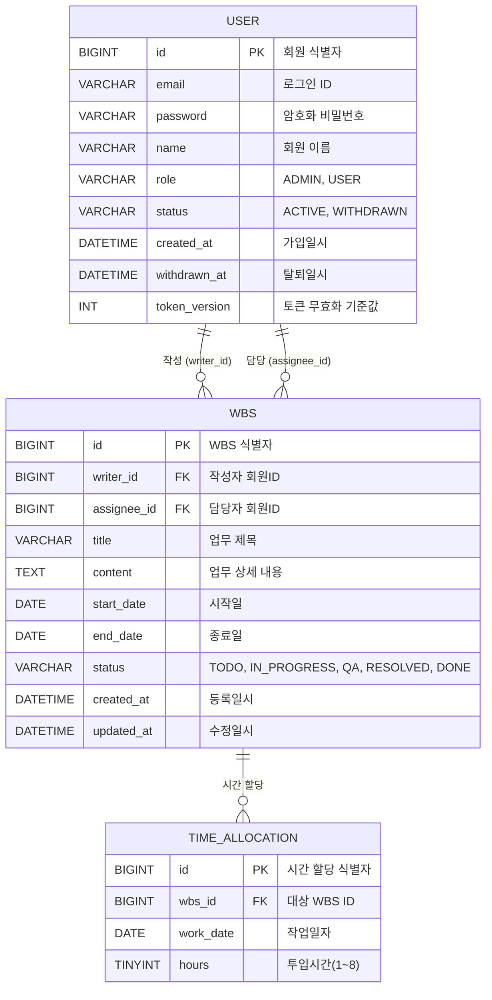

# ERD

```mermaid
erDiagram
    USER {
        BIGINT id PK "회원 식별자"
        VARCHAR email "로그인 ID"
        VARCHAR password "암호화 비밀번호"
        VARCHAR name "회원 이름"
        VARCHAR role "ADMIN, USER"
        VARCHAR status "ACTIVE, WITHDRAWN"
        DATETIME created_at "가입일시"
        DATETIME withdrawn_at "탈퇴일시"
        INT token_version "토큰 무효화 기준값"
    }

    WBS {
        BIGINT id PK "WBS 식별자"
        BIGINT writer_id FK "작성자 회원ID"
        BIGINT assignee_id FK "담당자 회원ID"
        VARCHAR title "업무 제목"
        TEXT content "업무 상세 내용"
        DATE start_date "시작일"
        DATE end_date "종료일"
        VARCHAR status "TODO, IN_PROGRESS, QA, RESOLVED, DONE"
        DATETIME created_at "등록일시"
        DATETIME updated_at "수정일시"
    }

    TIME_ALLOCATION {
        BIGINT id PK "시간 할당 식별자"
        BIGINT wbs_id FK "대상 WBS ID"
        DATE work_date "작업일자"
        TINYINT hours "투입시간(1~8)"
    }

    USER ||--o{ WBS : "작성 (writer_id)"
    USER ||--o{ WBS : "담당 (assignee_id)"
    WBS ||--o{ TIME_ALLOCATION : "시간 할당"
```
