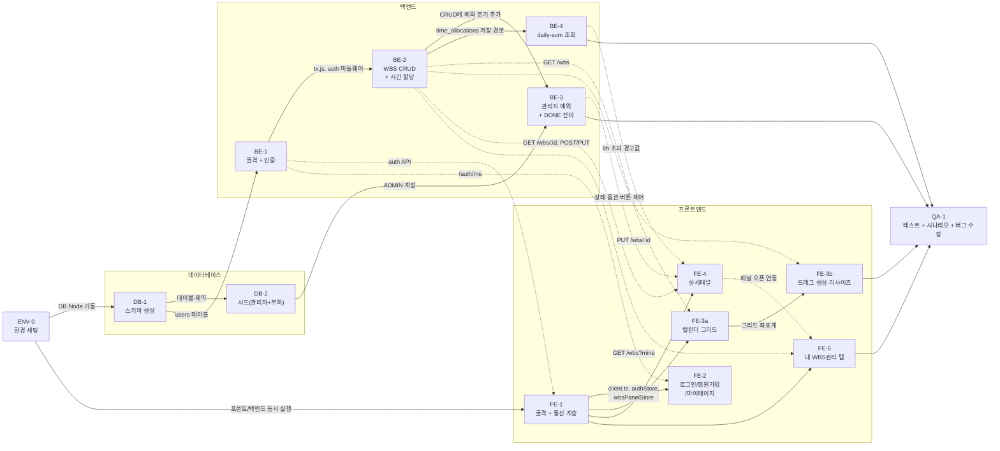

# Team WBS 실행계획

근거 문서: [1-domain-definition.md](./1-domain-definition.md) · [2-PRD.md](./2-PRD.md) · [3-user-scenario.md](./3-user-scenario.md) · [4-project-principle.md](./4-project-principle.md) · [6-wireframe.md](./6-wireframe.md) · [7-schema.sql](./7-schema.sql)

1인 개발 / 7일. 아래 3절의 의존 그래프는 **레이어 의존 기준**, 2절의 일차 배정은 **실제 작업 순서 기준**이다. PRD 7절 일정표는 "화면 완성 시점" 기준이라 축이 달라 그대로 대응되지 않으므로, 실제 진행은 2절을 따른다.

## 1. 일차 배정

| 일차 | Task | 비고 |
|---|---|---|
| 1일차 오전 | ENV-0, DB-1, DB-2 | 환경·스키마·시드 |
| 1일차 오후 | BE-1, FE-1 | 인증 / 프론트 골격 |
| 2일차 | BE-2, FE-2 | WBS CRUD / 인증 화면 |
| 3일차 | BE-3, FE-3a | 권한·상태전이 / 캘린더 그리드 |
| 4일차 | FE-3b | 드래그 인터랙션 — **버퍼 배정 구간** |
| 5일차 | BE-4, FE-4 | daily-sum / 상세패널 |
| 6일차 | FE-5 | 내 WBS관리 탭 |
| 7일차 | QA-1 | 테스트·시나리오·**버그 수정** |

BE-3을 3일차로 앞당긴 이유: FE-4(5일차)의 완료조건이 권한/상태전이 로직을 전제하므로 그 이전에 완료되어야 한다.

## 2. Task 의존 관계

실선 = 반드시 선행 완료 필요, 점선 = **착수는 가능하고 완료조건 검증 시점에만** 필요.



### 병렬 착수 가능 구간
- **FE-3a / FE-4 / FE-5는 FE-1 완료 후 서로 병렬 착수 가능** — 세 화면은 `wbsPanelStore`(열림 여부·대상 id·모드)라는 계약만 공유하므로 순차 의존이 아니다. 단 FE-5의 "항목 클릭 → 패널 오픈" 연동만 FE-4 완료 후 확인한다.
- **BE-3과 BE-4는 BE-2만 끝나면 서로 독립.**
- **FE Task는 백엔드 없이 착수 가능** — 목업 데이터로 UI를 만들고, 점선으로 표시된 완료조건만 해당 BE Task 이후에 체크한다.

### 임계 경로
`ENV-0 → DB-1 → BE-1 → BE-2 → BE-3 → FE-4 → FE-5 → QA-1`
프론트 경로 `FE-1 → FE-3a → FE-3b`는 소요시간 기준으로 가장 긴 구간(3~4일차)이며, FE-3b가 유일하게 버퍼가 배정된 고난이도 작업이다.

## 3. 리스크 대응 / 축소 계획

**가장 현실적인 실패 시나리오**: FE-3b(드래그 생성 + 끝단 리사이즈)가 4일차를 넘긴다. 이후 FE-4 → FE-5 → QA-1이 직렬로 밀려 7일차 검증 시간이 사라진다.

### 전환 트리거
- **4일차 종료 시점에 FE-3b가 미완이면 즉시 축소판으로 전환한다.** 판단을 5일차로 미루지 않는다.
- FE-3b 축소판: 드래그 대신 **시작 셀 클릭 → 종료 셀 클릭**으로 구간 지정. 기간 조정은 상세패널의 날짜 입력으로 대체.

### 폐기 우선순위 (위에서부터 버린다)
1. **막대 끝단 리사이즈 드래그** — 상세패널 날짜 입력으로 100% 대체 가능
2. FE-5의 상태별 건수 표시
3. 반응형 하단 시트 → 좁은 화면에서 전체폭 오버레이로 단순 대체
4. QA-1 자동 테스트 4종 중 2종(권한 검증·상태 전이만 필수로 남김)

### 롤백 지점
- Task 완료마다 커밋하고 `git tag be-2` 형태로 태그를 남긴다. 되돌릴 지점을 Task 경계와 일치시킨다.

## 4. API 계약

인증: `Authorization: Bearer <access_token>` 헤더. refresh는 httpOnly 쿠키로 자동 송신.
필드명은 DB 물리명 그대로 **snake_case**(원칙 3절, 매핑 레이어 없음). 배열 키도 테이블명과 동일하게 `time_allocations`.

| 엔드포인트 | 용도 | 요청 / 응답 |
|---|---|---|
| `POST /auth/signup` | 회원가입 | `{ email, password, name }` → `{ id, email, name, role }` (토큰 없음 → 로그인 화면으로) |
| `POST /auth/login` | 로그인 | → `{ access_token, user: { id, email, name, role } }` + refresh 쿠키(`refresh_token`) |
| `POST /auth/refresh` | 재발급 | 쿠키만 → `{ access_token, user }` |
| `POST /auth/logout` | 로그아웃 | `token_version` +1 |
| `DELETE /auth/me` | 탈퇴 | `status='WITHDRAWN'`, `token_version` +1 |
| `GET /auth/me` | 내 정보(마이페이지) | → `{ id, email, name, role }` |
| `GET /users` | 담당자 선택 목록 | → `[{ id, name, status }]` |
| `GET /wbs?from&to` | 캘린더 5주 조회 | → 아래 WBS 객체 배열 |
| `GET /wbs?mine=true&status=` | 내 WBS관리 탭(기간 무관, `from`/`to` 무시) | → 같은 형태, `status` 생략 시 전체 |
| `GET /wbs/:id` | 상세패널 단건 조회 | → WBS 객체 1건 |
| `POST /wbs` | 등록 | 아래 요청 바디 |
| `PUT /wbs/:id` | 수정(**전체 필드 치환**, 상태 변경도 이 경로) | 아래 요청 바디 |
| `DELETE /wbs/:id` | 삭제 | |
| `GET /time-allocations/daily-sum?user_id&from&to` | 8h 초과 경고용 (**assignee_id 기준** 합산) | → `[{ work_date, total_hours }]` — 편집 중인 WBS의 기존 저장분도 **포함**된 값 |

`from`/`to`/`mine`을 모두 생략한 `GET /wbs`는 400. `PUT`의 `time_allocations`는 기존 레코드를 전량 대체하므로 빈 배열을 보내면 시간 할당이 모두 삭제된다.
전체 스펙은 [swagger.json](./swagger.json) 참고.

**WBS 응답 객체**
```json
{ "id": 1, "writer_id": 3, "writer_name": "홍길동", "writer_status": "ACTIVE",
  "assignee_id": 5, "assignee_name": "김철수", "assignee_status": "WITHDRAWN",
  "title": "...", "content": "...", "start_date": "2026-08-11", "end_date": "2026-08-13",
  "status": "TODO",
  "time_allocations": [{ "work_date": "2026-08-11", "hours": 4 }] }
```

**WBS 요청 바디 (POST/PUT 동일, 프론트는 항상 모든 필드를 채워 보낸다)**
```json
{ "assignee_id": 5, "title": "...", "content": "...",
  "start_date": "2026-08-11", "end_date": "2026-08-13", "status": "TODO",
  "time_allocations": [{ "work_date": "2026-08-11", "hours": 4 }] }
```

**에러 응답** — `{ "error": { "code", "message" } }`

| code | HTTP | 발생 조건 |
|---|---|---|
| `VALIDATION_ERROR` | 400 | 필수값 누락, 이메일 형식 오류, `end_date < start_date`, `work_date`가 WBS 기간 밖 |
| `DUPLICATE_EMAIL` | 400 | 회원가입 이메일 중복 |
| `UNAUTHORIZED` | 401 | 토큰 없음/만료, `token_version` 불일치, 로그인 실패, 탈퇴 계정 로그인 |
| `FORBIDDEN` | 403 | 타인 글 수정/삭제, 일반 회원의 DONE 전이 |
| `NOT_FOUND` | 404 | 존재하지 않는 WBS id |

**탈퇴 표기 책임**: 서버는 `writer_status` / `assignee_status`만 내려주고, `"(탈퇴)"` 문자열 합성은 프론트가 담당한다(서버에서 문자열을 가공하지 않는다).

---

## 5. 준비

### ENV-0. 개발 환경 세팅
- 선행: 없음
- 작업: Node.js / PostgreSQL 17 설치 확인, 개발용 DB 생성, 백엔드·프론트 두 서버 동시 기동 구성(터미널 2개 또는 `concurrently`), Vite `server.proxy['/api']` 설정.
- 완료 조건
  - [ ] `psql -c "select version()"` 로 PostgreSQL 17 접속이 확인됨
  - [ ] 백엔드·프론트를 동시에 띄운 상태에서 프론트에서 백엔드 헬스 응답을 받음
  - [ ] `.gitignore`에 `.env`, `node_modules`가 포함됨

---

## 6. 데이터베이스

### DB-1. 스키마 생성
- 선행: ENV-0
- 작업: `docs/7-schema.sql`을 `backend/db/schema.sql`로 배치하고 적용. 3개 테이블, CHECK·UNIQUE·FK(CASCADE/RESTRICT) 제약, 인덱스 5개, `updated_at` 트리거 포함.
- 완료 조건
  - [x] `psql -f backend/db/schema.sql` 이 오류 없이 실행됨
  - [x] 3개 테이블이 생성되고, `\di` 로 인덱스 5개가 확인됨
  - [x] `end_date < start_date` INSERT가 CHECK 제약으로 거부됨
  - [x] `hours = 0` 또는 `hours = 9` INSERT가 CHECK 제약으로 거부됨
  - [x] 같은 `(wbs_id, work_date)` 중복 INSERT가 UNIQUE 제약으로 거부됨
  - [x] WBS 1건 삭제 시 하위 time_allocations가 함께 삭제됨(CASCADE)
  - [x] wbs UPDATE 시 `updated_at`이 트리거로 자동 갱신됨

### DB-2. 시드 (관리자 + 데모 데이터)
- 선행: DB-1
- 작업: `backend/db/seed.sql`에 ① 관리자 계정 1건(`role='ADMIN'`, bcrypt 해시), ② 일반 회원 3건, ③ 데모용 WBS 1건 + 시간 할당. 반복 실행 가능하도록 `ON CONFLICT (email) DO NOTHING` 적용. 해시 생성은 `node -e "console.log(require('bcrypt').hashSync('비밀번호',10))"`.
- **변경(2026-08-20, 사용자 피드백)**: 캘린더가 가짜 WBS로 빼곡히 채워져 화면 확인이 어렵다는 피드백에 따라 데모 데이터를 200건 → 1건으로 축소. `generate_series(1, 200)`를 `generate_series(1, 1)`로 변경(`s.n`의 범위 상수만 바꾸면 다시 늘릴 수 있음).
- 완료 조건
  - [x] seed.sql 실행 후 `role='ADMIN'` 계정이 1건 존재하고, password가 bcrypt 해시로 저장됨
  - [x] seed.sql을 두 번 연속 실행해도 오류 없이 통과함
  - [ ] ~~WBS 200건 이상이 5주 범위에 걸쳐 생성됨~~ — 데모 데이터를 1건으로 축소하며 폐기. QA-1 성능 검증(5주 조회 1초 이내) 시에는 `seed.sql`의 `generate_series(1, 1)`을 `generate_series(1, 200)`으로 임시로 늘려 별도 검증하고 되돌린다.

---

## 7. 백엔드 (Node.js + Express + pg)

### BE-1. 프로젝트 골격 + 인증
- 선행: DB-1
- 작업
  - `4-project-principle.md` 6절 디렉토리 구조로 골격 생성(`routes/ controllers/ db/ middleware/ utils/`)
  - `db/pool.js`(pg Pool), `db/tx.js`(`withTransaction`), `middleware/errorHandler.js`(4절 에러 코드 표 기준), `app.js`에 `morgan` 요청 로깅 등록
  - **CORS**: `cors({ origin: 프론트 주소, credentials: true })`
  - **쿠키**: refresh는 `httpOnly`, `SameSite=Lax`, 로컬은 `secure=false`
  - 4절 API 계약의 `/auth/*` 6개 엔드포인트 + `GET /users`
  - JWT access(15분) + refresh(14일), 폐기는 `users.token_version` 증가
  - `middleware/auth.middleware.js`: 라우트 진입 전 JWT 검증, `req.user` 세팅
  - 회원 관련 SQL은 `db/users.db.js`에만 작성
  - 환경변수 `.env` + `.env.example` (`DATABASE_URL`, `JWT_ACCESS_SECRET`, `JWT_REFRESH_SECRET`, `PORT`, `CORS_ORIGIN`)
- 완료 조건
  - [x] 회원가입 시 비밀번호가 bcrypt로 해시되어 저장되고, 이메일 형식 오류는 `VALIDATION_ERROR`(400), 중복은 `DUPLICATE_EMAIL`(400)로 거부됨
  - [x] 로그인 성공 시 access token(응답 바디) + refresh token(httpOnly 쿠키)이 발급됨
  - [x] 만료된 access token으로 요청 시 401 `UNAUTHORIZED` 반환
  - [x] `/auth/refresh`가 쿠키의 refresh token으로 신규 access token을 발급함
  - [x] 로그아웃/탈퇴 후 기존 refresh token으로 재발급 시도하면 `token_version` 불일치로 401 거부됨
  - [x] 탈퇴 계정(`status='WITHDRAWN'`)으로 로그인 시 401 반환
  - [x] `GET /auth/me`가 `{ id, email, name, role }`을 반환함
  - [x] `GET /users`가 담당자 선택용 `[{ id, name, status }]`를 반환함
  - [x] 모든 4xx/5xx 응답이 `{ error: { code, message } }` 포맷을 따름
  - [x] 브라우저에서 다른 포트의 프론트가 쿠키를 포함한 요청을 보내도 CORS 오류 없이 통과함
  - [x] `.env`가 커밋되지 않고 `.env.example`만 저장소에 있음

### BE-2. WBS CRUD + 시간 할당 저장
- 선행: BE-1
- 작업
  - 4절 계약의 `GET /wbs?from&to`, `GET /wbs?mine=true&status=`, `GET /wbs/:id`, `POST /wbs`, `PUT /wbs/:id`, `DELETE /wbs/:id`
  - 조회 응답에 `writer_status` / `assignee_status` 포함(탈퇴 표기는 프론트가 합성)
  - 시간 할당은 별도 API 없이 요청 바디의 `time_allocations` 배열로 함께 저장. 수정 시 기존 레코드 전량 삭제 후 재삽입, 전체를 `withTransaction`으로 묶음
  - 모든 SQL은 `db/*.db.js` 함수에만 작성(컨트롤러 직접 작성 금지)
  - 컨트롤러 검증: `work_date`가 해당 WBS의 `start_date ~ end_date` 범위 내인지
  - **권한은 이 단계에서 "본인 글만 수정/삭제"까지 구현**하고(`writer_id = req.user.id`), 관리자 예외는 BE-3에서 분기만 추가한다
- 완료 조건
  - [x] WBS 등록 시 상태가 `TODO`로 초기화되고 `time_allocations`가 같은 트랜잭션에서 함께 저장됨
  - [x] WBS 수정 시 기존 시간 할당이 전량 교체되고, 시간 할당 삽입을 일부러 실패시키면 WBS 변경도 롤백됨(DB 조회로 확인)
  - [x] `work_date`가 WBS 기간을 벗어나면 400 `VALIDATION_ERROR` 반환
  - [x] 존재하지 않는 WBS id로 `PUT`/`DELETE` 호출 시 404 `NOT_FOUND` 반환
  - [x] WBS 삭제 시 하위 시간 할당도 함께 사라짐
  - [x] `GET /wbs?from&to`가 5주 범위와 겹치는 WBS만 반환함
  - [x] `GET /wbs?mine=true&status=TODO`가 기간과 무관하게 본인 WBS를 상태별로 반환함
  - [x] `from`/`to`/`mine`을 모두 생략한 `GET /wbs`가 400 `VALIDATION_ERROR`를 반환함
  - [x] `PUT`에 빈 `time_allocations` 배열을 보내면 해당 WBS의 시간 할당이 전부 삭제됨
  - [x] 응답에 `writer_id`, `writer_status`, `assignee_status`가 포함됨
  - [x] 일반 회원이 타인 글 수정/삭제를 시도하면 403 `FORBIDDEN` 반환

### BE-3. 관리자 예외 + DONE 전이
- 선행: BE-2, DB-2
- 작업: BE-2에 구현된 권한 로직에 분기만 추가.
  - 관리자: 타인 글도 등록/수정 가능, **삭제는 작성자 본인만**(관리자도 불가)
  - 상태 전이: 일반 회원은 `RESOLVED`까지만, `DONE`은 관리자만 가능
  - `PUT /wbs/:id` 내에서 처리하며 별도 엔드포인트를 두지 않음
- 완료 조건
  - [x] 관리자가 타인 글을 수정하면 200으로 성공함
  - [x] 관리자가 타인 글 삭제를 시도하면 403 반환
  - [x] 일반 회원이 상태를 `DONE`으로 변경 시도하면 403 반환
  - [x] 관리자가 **타인 글의** 상태를 `DONE`으로 변경하면 200으로 성공함

### BE-4. 일자별 합계 조회 (8시간 초과 경고용)
- 선행: BE-2
- 작업: `GET /time-allocations/daily-sum?user_id&from&to` — **`assignee_id` 기준**으로 모든 WBS를 합친 일자별 시간 합계 반환. 로그인 필요하며, 담당자 지정을 위해 타인 `user_id` 조회를 허용한다. 8시간 초과 판정은 프론트가 `total_hours > 8`로 계산(임계값 상수는 프론트 `constants.ts`에 이미 존재).
- 완료 조건
  - [x] 한 회원이 여러 WBS에 같은 날짜로 시간을 넣은 경우 `total_hours`가 합산되어 반환됨
  - [x] 비로그인 요청 시 401 반환
  - [x] 타인 `user_id`로도 조회가 성공함
  - [x] 8시간 초과 상태로도 WBS 저장이 정상 성공함(하드 블록 없음)

---

## 8. 프론트엔드 (React 19 + Zustand + TanStack Query)

### FE-1. 프로젝트 골격 + 통신 계층
- 선행: ENV-0
- 작업
  - `4-project-principle.md` 6절 구조로 `pages/ features/ api/ shared/` 생성
  - `api/client.ts`: fetch 래퍼(**`credentials: 'include'`**), 401 시 refresh 1회 재시도 후 실패하면 로그인 화면 이동
  - **앱 부팅 시퀀스**: 마운트 직후 `/auth/refresh` 1회 호출 → 성공 시 인증 상태로 진입, 실패 시 로그인 화면. 이 호출이 끝날 때까지 라우터 가드를 활성화하지 않고 로딩 화면을 표시한다
  - `api/queryClient.ts`, `shared/constants.ts`(상태값 5종 + 색상 매핑 + 일일 기준시간 8)
  - `authApi.ts` + `authStore`(Zustand, accessToken만 메모리 보관)
  - **`wbsPanelStore`**(Zustand): 상세패널 열림 여부 / 대상 `wbs_id` / 모드(신규·수정) — 캘린더와 내 WBS관리 탭이 공유
  - 라우터 설정, 미인증 시 로그인 화면으로 리다이렉트
- 완료 조건 (서버 무관)
  - [x] 상태값/색상 상수가 `constants.ts`에만 정의됨 — `rg "'TODO'|'IN_PROGRESS'|'QA'|'RESOLVED'|'DONE'" frontend/src --glob '!**/constants.ts'` 결과가 0건
  - [x] `wbsPanelStore`가 정의되어 임의 컴포넌트에서 패널을 열고 닫을 수 있음
- 완료 조건 (BE-1 이후 연동 확인)
  - [ ] `JWT_ACCESS_SECRET` 만료시간을 임시로 10초로 낮춘 상태에서, 만료 후 API 호출이 자동 재발급되어 화면 조작 없이 이어짐 (액세스 토큰 만료 자동 재발급 자체는 재발급 로직 코드로 커버되나, 10초 설정 변경은 백엔드 서버 재시작이 필요해 수동 확인 필요)
  - [x] 재발급 실패 시 로그인 화면으로 이동함 (Playwright로 확인: refresh 쿠키 없이 보호 라우트 접근 시 `/login` 리다이렉트)
  - [x] 로그인 후 새로고침하면 로딩 화면을 거쳐 캘린더가 유지되고, 쿠키를 삭제한 뒤 새로고침하면 로그인 화면으로 이동함 (Playwright로 확인: 로그인 후 `/me` 새로고침 시 세션 유지)

### FE-2. 로그인 / 회원가입 / 마이페이지
- 선행: FE-1 (BE-1은 연동 확인 시점에만 필요)
- 작업: 와이어프레임 1·2·6번 화면. 마이페이지는 `GET /auth/me`로 이름/이메일 조회 + 로그아웃 + 탈퇴(확인 다이얼로그). **로그아웃/탈퇴 성공 시 `queryClient.clear()` 호출.**
- 완료 조건
  - [x] 로그인 성공 시 캘린더 메인으로 이동함
  - [x] 로그인/회원가입 실패 시 서버 `error.message`가 필드 하단에 표시됨
  - [x] 회원가입 후 해당 계정으로 로그인이 가능함
  - [x] 로그아웃 후 다른 계정으로 로그인했을 때 이전 계정의 WBS가 한순간도 보이지 않음(캐시 초기화 확인) — `useLogout`/`useWithdraw`의 `queryClient.clear()` 호출 코드 확인
  - [x] 탈퇴는 확인 다이얼로그를 거친 뒤 처리되고, 이후 같은 계정으로 로그인이 불가함

### FE-3a. 캘린더 그리드 (정적)
- 선행: FE-1 (BE-2는 연동 확인 시점에만 필요)
- 작업: 5주 그리드(오늘 포함 주가 항상 3번째 행), 상태별 색상 막대, 막대 클릭 시 `wbsPanelStore`로 패널 오픈 요청, 이전주/다음주 이동(`from`/`to` 변경 → refetch), 좁은 화면 가로 스크롤.
- 완료 조건
  - [x] 진입 시 오늘이 포함된 주가 정중앙(3번째 행)에 표시됨 (Playwright 스크린샷으로 확인: 오늘 20일이 3번째 주 블록에 표시)
  - [x] WBS 막대가 시작일~종료일 구간에 걸쳐 상태별 색상(회색/하늘색/초록색)으로 표시됨
  - [x] 이전주/다음주 이동 시 해당 기간의 WBS로 갱신됨 (코드 근거: `weekOffset` 변경 → queryKey 변경 → refetch)
  - [x] 375px 폭에서 그리드가 가로 스크롤로 열람 가능함 (코드 근거: `overflowX: 'auto'` + `minWidth: 700`)
  - [x] 막대 클릭 시 `wbsPanelStore`의 대상 id가 갱신됨 (코드 근거: `WbsBar`의 `onClick`이 `openEdit` 호출)

### FE-3b. 드래그 생성 + 끝단 리사이즈
- 선행: FE-3a (BE-2는 연동 확인 시점에만 필요)
- 작업: 빈 구간 드래그로 신규 작성(좌표→날짜 역매핑), 막대 끝단 드래그로 기간 조정 후 `PUT /wbs/:id`. **mutation 성공 시 `wbs` 목록 쿼리 invalidate.** 드래그는 데스크탑(마우스) 전용이며 모바일은 클릭 기반으로 대체한다.
- 완료 조건
  - [x] 빈 날짜 구간을 드래그하면 상세패널이 신규 작성 모드로 열리고 기간이 자동 반영됨 (Playwright로 확인: 8/6~8/8 드래그 → 시작일/종료일 정확히 반영)
  - [x] 막대 끝단 드래그로 기간을 조정하면 서버에 반영되고, 목록 쿼리 invalidate로 캘린더가 갱신됨 (코드 근거: `WbsBar.tsx` 리사이즈 핸들 → `useUpdateWbs` → invalidate)
  - [x] 3절 전환 트리거 검토 결과가 기록됨(원안 유지 또는 축소판 전환) — **원안(데스크탑 드래그) 유지로 결정**. 모바일/터치는 FE-4 상세패널의 시작일/종료일 `input`으로 대체 가능하다고 판단(`CalendarGrid.tsx`/`WbsBar.tsx` 주석에 근거 기록)

### FE-4. 게시글 상세패널 (+ 시간 할당 입력)
- 선행: FE-1 (BE-2 실선 / BE-3·BE-4는 연동 확인 시점에만 필요)
- 작업
  - 와이어프레임 4번 화면. 제목/내용/담당자/시작일/종료일/상태 + 일자별 수행시간(1시간 단위, 기간 범위만 입력칸 노출)
  - **패널은 `wbs_id` 또는 `{ start_date, end_date }`만 받아 자체적으로 `GET /wbs/:id` 조회한다** — 캘린더 상태에 의존하지 않으므로 FE-5에서도 그대로 재사용된다
  - 담당자 드롭다운은 `GET /users` 사용
  - 8시간 경고값 = **서버 daily-sum(다른 WBS의 저장분) + 현재 패널의 미저장 입력값**을 프론트에서 합산
  - 저장 성공 시 `wbs` 목록 쿼리 invalidate
  - 좁은 화면에서는 하단 시트로 전환. 권한에 따라 상태 옵션·삭제 버튼 노출 제어
- 완료 조건
  - [x] 캘린더에서 막대를 클릭하면 저장된 입력값과 시간 할당이 그대로 표시됨 (Playwright로 확인, 날짜 타임존 버그 수정 후 재확인)
  - [x] 일자별 시간 입력 시 이 WBS의 합계가 자동 표시됨
  - [x] 그 담당자의 해당 날짜 총합(저장분 + 미저장 입력값)이 8시간을 넘는 날에만 그 날짜 옆에 경고가 표시되고, 저장은 차단되지 않음 (코드 근거: `isOverLimit`)
  - [x] 담당자/작성자가 탈퇴 회원이면 이름 옆에 "(탈퇴)"가 표시됨 (Playwright로 확인: 담당자 드롭다운에 "테스트유저(탈퇴)")
  - [x] 일반 회원 화면에서 `DONE` 옵션이 선택 불가함 (Playwright로 확인: 일반 회원 계정에서 상태 드롭다운에 DONE 미노출)
  - [x] 삭제 버튼이 작성자 본인에게만 노출됨(관리자 포함 타인에게는 미노출) (Playwright로 확인: 타인 글 열람 시 삭제 버튼 없음)
  - [x] 종료일 < 시작일 입력 시 저장이 차단되고 오류 메시지가 표시됨
  - [x] 저장 후 캘린더 막대가 즉시 갱신됨(쿼리 invalidate 확인) (코드 근거: `useCreateWbs`/`useUpdateWbs`의 invalidateQueries), 저장 실패 시(예: 403) 오류 메시지도 표시되도록 버그 수정
  - [x] 375px 폭에서 우측 패널이 하단 시트로 전환됨 (코드 근거: `WbsDetailPanel.css`의 `@media (max-width: 375px)`)

### FE-5. 내 WBS관리 탭
- 선행: FE-1 (목록·탭은 독립 / FE-4는 패널 오픈 연동 확인 시점에만 필요)
- 작업: 와이어프레임 5번 화면. 우측 하단 진입 버튼, 상태값 5종 탭, `GET /wbs?mine=true&status=`로 기간 무관 본인 목록 조회(제목/기간/건수). 항목 클릭 시 `wbsPanelStore`로 FE-4 패널 오픈.
- 완료 조건
  - [x] 상태별 탭 전환이 동작하고 각 탭에 본인 WBS만 표시됨 (Playwright로 확인)
  - [x] 캘린더 5주 범위를 벗어난 과거 WBS도 목록에 표시됨 (Playwright로 확인: 2026-07-17 시작 항목 표시)
  - [x] 각 상태의 건수가 표시됨 (Playwright로 확인: "TODO (13)" 등)
  - [x] 목록 항목 클릭 시 상세패널이 열림(FE-4 컴포넌트 재사용) (Playwright로 확인)
  - [x] 375px 폭에서 하단 시트 또는 전체폭 오버레이로 전환됨 (코드 근거: `MyWbsTabs.css`의 `@media (max-width: 375px)`)

---

## 9. 검증

### QA-1. 핵심 규칙 테스트 + 시나리오 검증 + 버그 수정
- 선행: BE-3, BE-4, FE-3b, FE-5 (전이적으로 전체 Task)
- 작업
  - `backend/tests/*.test.js`에 supertest로 4종 테스트: ① 권한 검증(타인 글 수정 403 / 관리자 예외 200 / 관리자 삭제 403), ② 상태 전이 권한(회원 DONE 403 / 관리자 DONE 200), ③ 8시간 초과 경고(daily-sum 합산값), ④ `work_date` 범위 검증(400)
  - `3-user-scenario.md` 기준 수동 시나리오 검증
  - 발견 버그 수정
- 완료 조건
  - [ ] 테스트 4종이 각 1개 이상 작성되고 전부 통과함
  - [ ] 일반 회원 시나리오 1-1(로그인 후 5주 뷰 표시) ~ 1-8(로그아웃/세션 유지)이 각 시나리오의 완료 조건대로 수행됨
  - [ ] 관리자 시나리오 2-1(타인 글 수정), 2-2(타인 글 DONE 처리)가 수행됨
  - [ ] DB-2 시드(회원 4명 / WBS 200건) 상태에서 캘린더 5주 조회가 1초 이내에 응답함
  - [ ] 375px 폭에서 캘린더 메인·상세패널(하단 시트 전환)·내 WBS관리 탭이 정상 동작함
  - [ ] 위 검증에서 발견된 버그가 모두 수정되었거나, 미수정 건이 잔여 이슈로 기록됨
